# SDLC + AI Standard LAND4

Este estándar define cómo humanos y agentes colaboran desde el backlog hasta el despliegue. La IA acelera el trabajo; la decisión de merge sigue requiriendo aprobación humana.

## Glosario

| Sigla | Significado |
| :--- | :--- |
| CU | Caso de Uso, contrato vivo del dominio. |
| CA | Criterio de Aceptación. |
| PM | Project Manager General. |
| PMA | Project Manager Architect. |
| PMB | Project Manager Business. |
| PMC | Project Manager Commercial. |
| US | User Story. `HU` queda como alias histórico. |
| CP | Caso de Prueba. |

## Flujo

```mermaid
flowchart LR
    Backlog["1. Backlog<br/>Humano + PM"] --> Refine["2. Refinamiento<br/>PMA / PMB / PMC"]
    Refine --> Contract["3. CU actualizado<br/>CONTRACT.md"]
    Contract --> Ready["4. US Ready<br/>Issue + CA + CP"]
    Ready --> InProgress["5. US In Progress<br/>inicio técnico"]
    InProgress --> Extract["6. Extracción<br/>Issue + CU"]
    Extract --> Prompt["7. Prompt<br/>rol técnico"]
    Prompt --> Implement["8. Implementación<br/>TDD"]
    Implement --> Review["9. PR<br/>Reviewer Codex + humano"]
    Review --> Delivery["10. CI/CD<br/>checks + deploy"]
    Delivery -. feedback .-> Backlog
```



## Fuentes de verdad

| Artefacto | Fuente canónica |
| :--- | :--- |
| CU | `docs-repo/req/<caso-de-uso>/CONTRACT.md` versionado con el código y publicado bajo `Requerimientos de Negocio > Casos de Uso`. |
| US, CA, CP y tareas | Issue de la plataforma de backlog. GitHub Issues es el primer adaptador. |
| Estado de US | GitHub Projects en la primera implementación. |
| Prompt | Artefacto temporal reproducible generado desde US + CU. |
| Documentación técnica | `README.md`, `AGENTS.md` y `docs-repo/` del repositorio. |

## Automatización MVP

La automatización queda separada por responsabilidad:

- Una skill de administración de GitHub Projects prepara insumos locales desde GitHub.
- `l4-architect` trabaja con esos insumos locales, genera contexto, prompt y plan sin leer GitHub Projects.
- Los scripts globales en `docs-repo/scripts/sdlc-ai/` permanecen como MVP de referencia y compatibilidad mientras se consolida la lógica autocontenida en skills.

La extracción y la generación del plan arrancan cuando la US pasa de `Ready` a `In Progress`. `Ready` indica que la US está suficientemente refinada para iniciar; no obliga a ejecutar todavía el extractor.

```bash
node --disable-warning=ExperimentalWarning --experimental-strip-types \
  docs-repo/scripts/sdlc-ai/extract-agent-context.ts \
  --issue <url-o-numero> --repo <owner/repo> \
  --out .tmp/land4-prompts/context.json

node --disable-warning=ExperimentalWarning --experimental-strip-types \
  docs-repo/scripts/sdlc-ai/generate-agent-prompt.ts \
  --context .tmp/land4-prompts/context.json \
  --role land4-implementer \
  --out .tmp/land4-prompts/prompt.md
```

Para pruebas reproducibles sin red, sustituye `--issue` por `--fixture <issue.json>`.

El extractor implementa un adaptador GitHub mediante `gh issue view`. El modelo normalizado permite agregar adaptadores para Jira, Azure DevOps u otras plataformas sin cambiar el contrato CU ni el generador de prompts. El prompt conserva trazabilidad, tareas, CA, CP y el contexto completo de cada CU relacionado.

## Gates

| Gate | Condiciones |
| :--- | :--- |
| `Ready` | CU vigente, US completa, CA verificables y CA → CP trazable. |
| `In Progress` técnico | La US ya pasó a `In Progress` y el flujo técnico puede ejecutar extracción, prompt y plan sin bloquear el refinamiento previo. |
| PR revisable | Implementación acotada, pruebas ejecutadas, cobertura reportada y decisión Docs-as-Code explícita. |
| `Done` | CI verde, Reviewer Codex ejecutado, aprobación humana, documentación actualizada y merge completado. |
