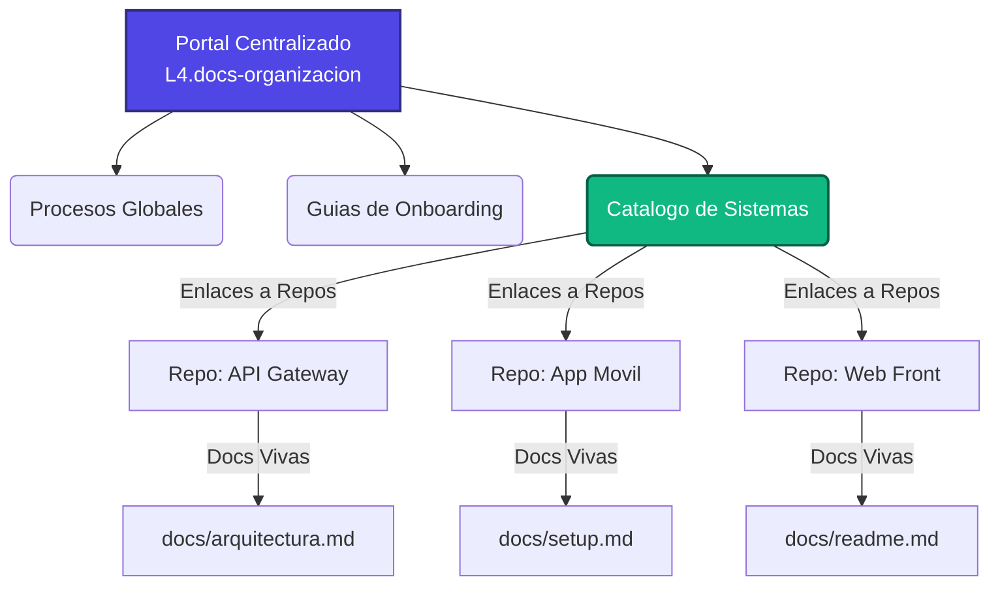

# 🚀 Portal de Documentación Centralizado — LAND4

¡Bienvenido al centro de conocimiento de **LAND4**! Este portal es la fuente única de verdad para el onboarding, estándares de desarrollo, procesos globales y arquitectura de nuestros sistemas.

---

## 🏗️ Arquitectura Híbrida de Documentación

Para garantizar que la documentación técnica no se quede obsoleta y evolucione a la par del código fuente, en **LAND4** adoptamos un modelo de documentación **híbrido y versionado**:

1. **El Portal Central (Este Repositorio):** Aloja las políticas de ingeniería, guías de estilo, onboarding y el catálogo que redirige a los repositorios de cada sistema.
2. **Documentación Viva (Cada Repositorio):** Los detalles específicos de instalación, arquitectura de software, endpoints de API y guías de despliegue de cada sistema residen directamente en la carpeta `/docs` de su propio repositorio, versionados al lado del código.

---

## 🔍 Secciones del Portal

Navega a través de los menús laterales o utiliza los enlaces directos a continuación:

*   **[🗺️ Catálogo de Sistemas](repositorios.md):** Accede a la documentación técnica específica de cada uno de los microservicios, APIs y aplicaciones de LAND4.
*   **[🚀 Guía de Onboarding](onboarding/bienvenida.md):** Si eres nuevo en el equipo de tecnología, sigue esta guía paso a paso para configurar tus accesos y tu entorno local.
*   **[📝 Guía: ¿Cómo Documentar?](como-documentar.md):** Aprende el estándar para estructurar y mantener actualizada la documentación técnica en tu repositorio de código.

---

## 🛠️ Cómo colaborar con esta documentación

Este portal se genera automáticamente usando **Jekyll** y el tema **Just the Docs** a través de GitHub Pages. Si deseas agregar una política global o corregir información general:

1. Realiza tus cambios en una nueva rama en este repositorio.
2. Envía un **Pull Request**.
3. Al aprobarse y fusionarse en la rama `main`, los cambios se compilarán y desplegarán automáticamente.
